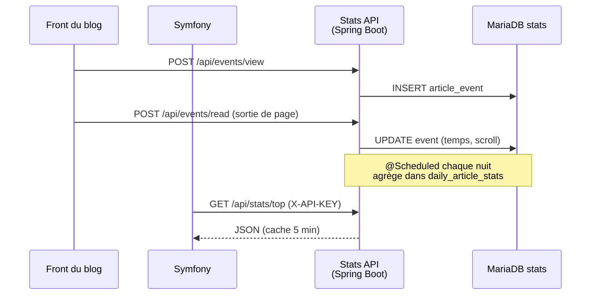

# PRD — Blog Stats API (Spring Boot)

Sep 24, 2026 · @Valentin

## Contexte et problème

Le blog tourne sous Symfony (articles, utilisateurs, auth) mais ne sait pas quels articles sont lus, combien de temps, ni s'ils sont lus jusqu'au bout. On construit un **microservice Spring Boot indépendant** qui collecte les événements de lecture et expose des statistiques en REST.

- Symfony reste propriétaire des articles : le service ne stocke que l'`articleId` et une copie du titre, envoyée par Symfony.
- Le service a sa propre base de données, ne lit jamais celle de Symfony.
- Projet d'apprentissage Spring Boot : périmètre volontairement réduit à 3 endpoints de lecture + l'ingestion nécessaire pour les alimenter.

**Périmètre de ce PRD : l'API seule (phase 1).** On construit et teste l'API Spring Boot de façon autonome (curl, Swagger, Postman, données de démo). L'intégration dans Symfony et le front du blog (script de suivi, appels `HttpClient`, bloc « Populaire », synchronisation des articles) viendra ensuite, en phase 2. Les mentions de Symfony dans ce document décrivent le contrat qu'il utilisera, pas du travail à faire maintenant.

**Projet Symfony de référence** : `/Users/diatra/Documents/03_SCHOOL/YEAR3/Symphony/` (Symfony 8.1, PHP 8.4, PostgreSQL 16, `symfony/http-client` déjà installé).

| Élément Symfony | Ce que l'API en reprend |
| --- | --- |
| Entité `Article` : `id` (int auto-incrémenté), `title`, `description`, `imageName`, `author`, `createdAt`, `updatedAt` | `id` → `articleId` (Long), `title`, `createdAt` |
| Pas de slug : pages sur `/articles/{id}` | L'API ne gère pas de slug ; le lien se construit avec l'id |
| Suppression physique d'un article (commentaires en `orphanRemoval`) | `DELETE /api/articles/{id}` marque l'article supprimé côté stats |
| Rôles `ROLE_USER` / `ROLE_ADMIN` | `ROLE_ADMIN` sert à exclure les admins du suivi (phase 2) |

## Objectifs

Livrer une API REST qui répond à trois questions : comment performe un article, quels articles marchent, comment évolue le trafic.

**Objectifs**

- `GET /api/stats/articles/{id}` : vues, lecteurs uniques, temps moyen, taux de lecture complète.
- `GET /api/stats/top` : classement des articles les plus lus sur une période.
- `GET /api/stats/trends` : vues par jour sur un intervalle, prêtes pour un graphique.
- Collecter les événements `view` et `read` envoyés par le front du blog.

**Hors périmètre (v1)**

- Likes, referrers, géolocalisation, device.
- Temps réel (WebSocket) : les stats peuvent avoir jusqu'à 5 min de retard.
- Interface graphique : c'est Symfony / le front qui affiche.
- Gestion des articles ou des utilisateurs.
- Intégration Symfony et front du blog : phase 2.

**Critères de succès**

| Mesure | Cible |
| --- | --- |
| Latence p95 des GET stats | < 200 ms avec 100 000 événements |
| Latence p95 de l'ingestion | < 50 ms |
| Couverture de tests (service + controller) | ≥ 70 % |
| Doublons de vues (même session, 30 min) | 0 compté en plus |

## Utilisateurs et cas d'usage

L'API a deux consommateurs : le front du blog (écrit les événements) et le backend Symfony (lit les stats).

| Acteur | Besoin | Endpoint |
| --- | --- | --- |
| Lecteur (via le front) | Sa lecture est comptée sans gêne ni compte requis | `POST /api/events/view`, `POST /api/events/read` |
| Admin du blog | Voir les chiffres d'un article dans le back-office | `GET /api/stats/articles/{id}` |
| Page d'accueil Symfony | Afficher un bloc « Populaire cette semaine » | `GET /api/stats/top?period=7d&limit=5` |
| Dashboard admin | Tracer la courbe des vues du mois | `GET /api/stats/trends?from=&to=` |

## Architecture

Le front envoie les événements directement au service Stats ; Symfony ne fait que lire les agrégats côté serveur.



- **Ingestion** : appelée par le navigateur (CORS limité au domaine du blog), sans authentification, avec limitation de débit.
- **Lecture** : appelée par Symfony via `HttpClient`, protégée par une clé d'API partagée.
- **Stockage** : événements bruts + table d'agrégats journaliers pour que les GET restent rapides.
- **Hébergement** : serveur séparé de Symfony, avec son propre Docker Compose (conteneurs API + MariaDB), HTTPS et une URL publique (ex. `stats.monblog.fr`).

## Définitions des métriques

Chaque chiffre renvoyé par l'API suit une règle unique, fixée ici.

| Métrique | Règle de calcul |
| --- | --- |
| Vue (`views`) | 1 événement `view` par couple (`sessionId`, `articleId`) toutes les 30 min ; les suivants sont ignorés |
| Lecteur unique (`uniqueReaders`) | Nombre de `sessionId` distincts sur la période |
| Temps moyen (`avgReadTimeSeconds`) | Moyenne de `timeSpentSeconds` des événements `read`, bornée à [2 s ; 1 800 s] pour écarter onglets oubliés et rebonds |
| Lecture complète | Un `read` avec `scrollPercent ≥ 90` **et** `timeSpentSeconds ≥ 30` |
| Taux de lecture complète (`completionRate`) | Lectures complètes / vues, arrondi à 2 décimales (0.00–1.00) |

Le `sessionId` est un UUID généré par le front et gardé en `sessionStorage` : aucune donnée personnelle, pas de cookie.

## Spécification de l'API

Base URL `/api`, JSON uniquement, horodatages en ISO 8601 (UTC), jours et périodes calculés en heure française (Europe/Paris). Les trois GET demandés sont le cœur du produit ; les deux POST existent seulement pour les alimenter.

### GET /api/stats/articles/{id}

Statistiques d'un article, sur toute sa vie ou sur une période.

| Paramètre | Type | Requis | Défaut | Règle |
| --- | --- | --- | --- | --- |
| `id` (path) | Long | oui | – | id de l'article côté Symfony |
| `period` | String | non | `all` | `24h`, `7d`, `30d`, `90d`, `all` |

```json
{
  "articleId": 42,
  "title": "Débuter avec Spring Boot",
  "period": "30d",
  "views": 1280,
  "uniqueReaders": 954,
  "avgReadTimeSeconds": 187,
  "completionRate": 0.41,
  "lastViewedAt": "2026-09-23T18:04:11Z"
}
```

Article inconnu de la table `article` → `404`. Article connu mais sans événement → `200` avec des zéros.

### GET /api/stats/top

Articles les plus lus, triés par `views` décroissant, puis `uniqueReaders`.

| Paramètre | Type | Requis | Défaut | Règle |
| --- | --- | --- | --- | --- |
| `period` | String | non | `7d` | `24h`, `7d`, `30d`, `90d`, `all` |
| `limit` | int | non | `5` | 1 à 50 |

```json
{
  "period": "7d",
  "generatedAt": "2026-09-24T09:00:00Z",
  "items": [
    { "rank": 1, "articleId": 42, "title": "Débuter avec Spring Boot", "views": 512, "uniqueReaders": 430, "completionRate": 0.47 },
    { "rank": 2, "articleId": 17, "title": "Symfony vs Spring", "views": 388, "uniqueReaders": 301, "completionRate": 0.33 }
  ]
}
```

Les articles supprimés (`deleted = true`) sont exclus du classement.

### GET /api/stats/trends

Vues par jour sur un intervalle ; chaque jour est présent, même à 0, pour tracer une courbe continue.

| Paramètre | Type | Requis | Défaut | Règle |
| --- | --- | --- | --- | --- |
| `from` | LocalDate | non | aujourd'hui − 29 j | `YYYY-MM-DD` |
| `to` | LocalDate | non | aujourd'hui | `from ≤ to`, 366 jours max |
| `articleId` | Long | non | – | absent = tout le blog |

```json
{
  "from": "2026-09-01",
  "to": "2026-09-03",
  "articleId": null,
  "totalViews": 734,
  "points": [
    { "date": "2026-09-01", "views": 210, "uniqueReaders": 180 },
    { "date": "2026-09-02", "views": 0, "uniqueReaders": 0 },
    { "date": "2026-09-03", "views": 524, "uniqueReaders": 410 }
  ]
}
```

### Ingestion et synchronisation (requises pour alimenter les stats)

| Méthode | Route | Appelé par (phase 2) | Corps | Réponse |
| --- | --- | --- | --- | --- |
| POST | `/api/events/view` | Front du blog | `{ "articleId": 42, "sessionId": "uuid" }` | `202 Accepted` |
| POST | `/api/events/read` | Front du blog | `{ "articleId": 42, "sessionId": "uuid", "timeSpentSeconds": 185, "scrollPercent": 94 }` | `202 Accepted` |
| PUT | `/api/articles/{id}` | Symfony (clé d'API) | `{ "title": "Débuter avec Spring Boot", "createdAt": "2026-09-01T08:00:00+02:00" }` | `204` (crée ou met à jour) |
| DELETE | `/api/articles/{id}` | Symfony (clé d'API) | – | `204` (suppression logique, stats conservées) |

En phase 1, ces routes sont appelées à la main (curl, Swagger, Postman) et par un jeu de données de démo. Un événement pour un `articleId` inconnu est accepté (`202`) mais ignoré, pour ne pas polluer les stats avec des ids inventés.

Le front envoie `read` avec `navigator.sendBeacon` à la fermeture ou au changement d'onglet.

### Erreurs

Format unique via `@RestControllerAdvice` (RFC 9457 `ProblemDetail`) :

```json
{ "type": "about:blank", "title": "Bad Request", "status": 400, "detail": "limit must be between 1 and 50", "instance": "/api/stats/top" }
```

| Code | Cas |
| --- | --- |
| 400 | Paramètre invalide (`period` inconnu, `from > to`, `limit` hors bornes, corps invalide) |
| 401 | Clé d'API absente ou fausse sur `/api/stats/**` |
| 429 | Trop d'événements pour une même IP / session |
| 500 | Erreur interne, sans stack trace dans la réponse |

## Modèle de données

Deux tables : les événements bruts (source de vérité) et un agrégat par article et par jour (lecture rapide).

**`article_event`** — entité JPA `ArticleEvent`

| Colonne | Type | Note |
| --- | --- | --- |
| `id` | BIGINT AUTO_INCREMENT PK | |
| `article_id` | BIGINT, not null | id Symfony |
| `session_id` | UUID, not null | type natif MariaDB |
| `type` | VARCHAR(10) | enum `VIEW`, `READ` |
| `time_spent_seconds` | INT, null | `READ` uniquement |
| `scroll_percent` | TINYINT UNSIGNED, null | 0–100, `READ` uniquement |
| `occurred_at` | DATETIME(6), not null | UTC, fixé par le serveur |

Index : `(article_id, occurred_at)`, `(occurred_at)`, `(session_id, article_id, occurred_at)` pour le dédoublonnage.

**`daily_article_stats`** — entité JPA `DailyArticleStats`

| Colonne | Type | Note |
| --- | --- | --- |
| `article_id` | BIGINT | PK composite |
| `day` | DATE | PK composite |
| `views` | INT | |
| `unique_readers` | INT | |
| `total_read_time_seconds` | BIGINT | pour recalculer la moyenne |
| `read_count` | INT | |
| `completed_reads` | INT | |

- Un job `@Scheduled(cron = "0 5 0 * * *")` recalcule la veille à 00:05 heure de Paris (zone Europe/Paris).
- Le jour courant est calculé à la volée depuis `article_event`, puis ajouté aux agrégats.
- Les événements bruts de plus de 13 mois sont supprimés par le même job.

**`article`** — entité JPA `Article` (copie minimale, remplie par `PUT /api/articles/{id}`)

| Colonne | Type | Note |
| --- | --- | --- |
| `id` | BIGINT PK | même id que Symfony, pas généré |
| `title` | VARCHAR(255), not null | même limite que Symfony |
| `created_at` | DATETIME(6), not null | UTC ; `Article::createdAt` côté Symfony |
| `deleted` | BOOLEAN, default false | suppression logique |
| `synced_at` | DATETIME(6) | UTC ; dernier `PUT` reçu |

Tables en InnoDB, jeu de caractères `utf8mb4` (accents et emojis dans les titres). JDBC configuré avec `hibernate.jdbc.time_zone=UTC` pour que toutes les dates soient écrites en UTC.

Les jours de `daily_article_stats.day` sont des jours calendaires en heure française (Europe/Paris), passage heure d'été/hiver compris.

Limite connue : `uniqueReaders` sur plusieurs jours additionne des valeurs journalières (un lecteur venu 2 jours compte 2). Pour la v1, `/articles/{id}` calcule ce chiffre exactement depuis `article_event` ; `/top` et `/trends` utilisent l'agrégat.

## Exigences non fonctionnelles

| Thème | Exigence |
| --- | --- |
| Sécurité | `/api/stats/**` exige l'en-tête `X-API-KEY` (filtre Spring Security, clé en variable d'environnement). `/api/events/**` public, CORS limité à l'origine du blog |
| Anti-spam | 60 événements / min / IP (Bucket4j ou filtre maison) ; dédoublonnage des vues sur 30 min |
| Validation | Bean Validation sur les DTO : `@NotNull`, `@Positive`, `@Min(0) @Max(100)` sur `scrollPercent`, `@Max(1800)` sur `timeSpentSeconds` |
| Performance | `@Cacheable` (Caffeine, TTL 5 min) sur `/top` et `/trends` ; lectures sur l'agrégat |
| RGPD | Pas d'IP stockée, pas de cookie, `sessionId` anonyme ; conservation 13 mois |
| Observabilité | Spring Boot Actuator : `/actuator/health`, `/actuator/metrics` |
| Documentation | OpenAPI générée par springdoc, Swagger UI sur `/swagger-ui.html` |
| Tests | `@WebMvcTest` (controllers), `@DataJpaTest` + Testcontainers MariaDB (requêtes), JUnit 5 + Mockito (services, règles de calcul) |

## Stack technique et structure

Java 21, Spring Boot 3.x, Maven, **MariaDB 11.4 LTS**, le tout lancé avec **Docker** (H2 accepté au jalon 1 seulement). Le `Dockerfile` construit l'API en deux étapes (build Maven, puis image JRE 21 légère) ; `compose.yaml` lance les conteneurs `stats-api` (port 8080) et `stats-db` (MariaDB, port 3306, volume persistant). Pas de conflit avec Symfony, qui utilise PostgreSQL sur le port 5432.

| Dépendance | Rôle |
| --- | --- |
| spring-boot-starter-web | Controllers REST |
| spring-boot-starter-data-jpa + mariadb-java-client | Persistance |
| spring-boot-starter-validation | Validation des DTO |
| spring-boot-starter-security | Clé d'API |
| spring-boot-starter-cache + caffeine | Cache des stats |
| spring-boot-starter-actuator | Health, métriques |
| flyway-core | Migrations SQL |
| springdoc-openapi-starter-webmvc-ui | Swagger |
| lombok | Moins de boilerplate |
| spring-boot-starter-test + testcontainers | Tests |

```
src/main/java/com/blog/stats/
├── StatsApplication.java
├── config/          SecurityConfig, CorsConfig, CacheConfig
├── controller/      EventController, StatsController
├── dto/             ViewEventRequest, ReadEventRequest, ArticleStatsResponse, TopResponse, TrendsResponse
├── entity/          ArticleEvent, DailyArticleStats, EventType
├── repository/      ArticleEventRepository, DailyArticleStatsRepository
├── service/         EventService, StatsService, AggregationJob
├── exception/       GlobalExceptionHandler
└── util/            Period (enum 24h, 7d, 30d, 90d, all)
src/main/resources/
├── application.yml
└── db/migration/    V1__init.sql
```

## Jalons et critères d'acceptation

Quatre jalons pour la phase 1 (API seule), chacun livrable et testable seul ; la dernière ligne rappelle la phase 2.

| Jalon | Contenu | Terminé quand |
| --- | --- | --- |
| J1 — Ingestion | Projet Initializr, entité `ArticleEvent`, `POST /events/view` et `/events/read`, validation, H2 | Un `curl` crée une ligne en base ; un corps invalide renvoie 400 |
| J2 — Stats article | `GET /stats/articles/{id}` calculé depuis les événements bruts, dédoublonnage 30 min | Sur un jeu de 10 événements connus, les 4 métriques sont exactes (test unitaire) |
| J3 — Top et trends | Agrégat `daily_article_stats`, job `@Scheduled`, `/top`, `/trends` avec jours à 0 | `/trends` sur 30 jours renvoie 30 points ; `/top?limit=51` renvoie 400 |
| J4 — Production-ready | Dockerfile + Docker Compose (API + MariaDB) + Flyway, clé d'API, CORS, rate limit, cache, Swagger | Sans clé → 401 ; 61 événements/min → 429 ; Swagger accessible |
| Phase 2 (hors PRD) — Intégration Symfony | Script JS dans le template Twig, service `StatsClient` Symfony (`HttpClient`), bloc « Populaire » | La page d'accueil affiche le top 5 réel |

**Critères transverses**

- [ ] Tous les endpoints documentés dans Swagger avec exemples.
- [ ] Couverture de tests ≥ 70 % sur `service` et `controller`.
- [ ] `docker compose up` lance l'API et sa base sans autre étape.
- [ ] README avec les commandes `curl` de chaque endpoint.

## Risques et questions ouvertes

| Risque | Impact | Parade |
| --- | --- | --- |
| Bots et crawlers gonflent les vues | Stats fausses | Ignorer les `User-Agent` de bots connus ; ingestion déclenchée par JS seulement |
| `sendBeacon` perdu (fermeture brutale, mobile) | Temps moyen sous-estimé | Envoyer aussi un `read` intermédiaire toutes les 30 s |
| Bloqueurs de pub coupent les appels | Vues manquantes | Route neutre (pas de mot « analytics ») ou proxy via Symfony |
| Article supprimé côté Symfony | Apparaît encore dans `/top` | Symfony filtre les ids inconnus ; v2 : webhook de suppression |

**Décisions**

| Question | Décision | Conséquence dans le PRD |
| --- | --- | --- |
| Titre et slug dans les réponses ? | Oui pour le titre ; pas de slug car Symfony n'en a pas (URL /articles/{id}) | Table `article` synchronisée par Symfony via `PUT /api/articles/{id}` |
| Exclure les vues des admins ? | Oui | Symfony n'injectera pas le script de suivi dans Twig pour `ROLE_ADMIN` (phase 2) ; rien à coder côté API |
| Fuseau des jours dans `/trends` | Heure française (`Europe/Paris`) | Jours, périodes et job nocturne calculés en `Europe/Paris` ; horodatages stockés en UTC |
| Hébergement | Séparé de Symfony | Docker Compose propre, HTTPS, URL publique ; Symfony appelle l'API par Internet avec la clé |
